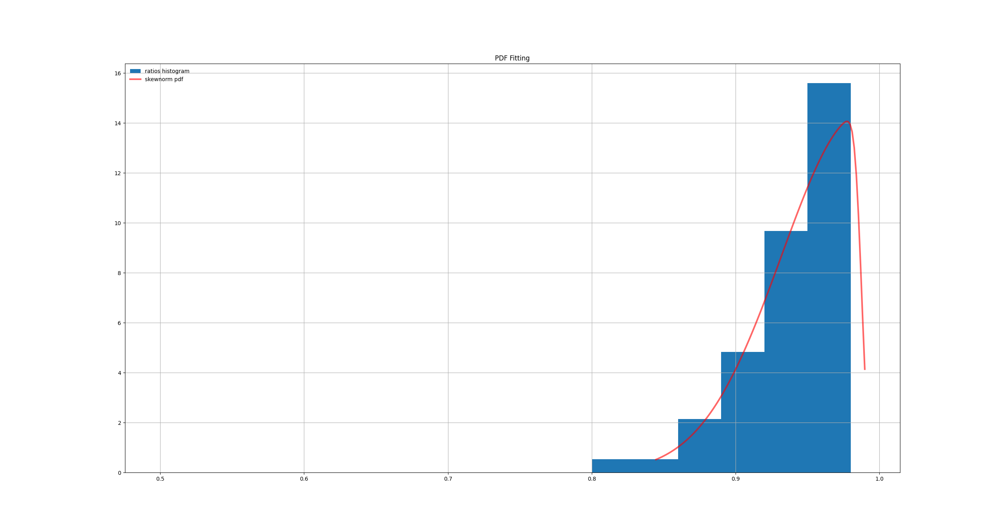
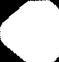
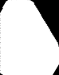
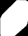
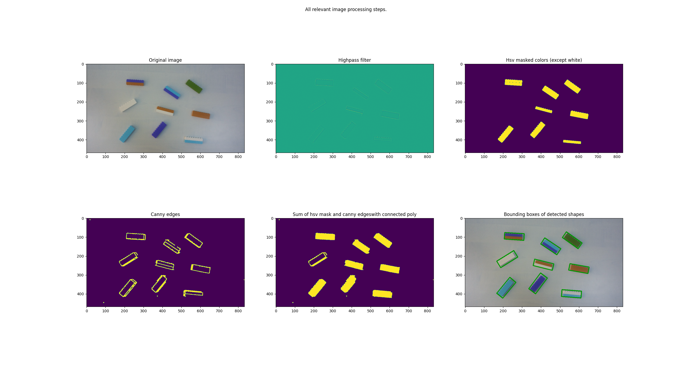

# Vision systems final project short summary

Main idea for the project was to create something similar in structure and 
function to RandomForestClassifier in a sense that the classification will be 
performed by a series of pretty weak classifiers, but together they will create 
a strong one.

#### The structure of the voting classifier

Voting for a lego class is performed by 3 classifiers:
* Sides ratio
* Histogram match 
* Shape match

First two were tuned with use of distribution of corresponding values. From 
the distribution was created a PDF function from which probability was used 
as a measure of vote for that classifier. For example of such PDF function, see the
included graphic.



As this function is a continous there is specified range in which the value might 
lay and for this range the probability is calculated. This approach was used for 
both Sides ratio classifier and Histogram match.

Shape match classifier uses a detected contour that is filled and supplied with 
convex hull, so even contours that would not be filled normally due some deffects,
are filled thanks to convex hull:





This obviously deforms the shape, but it is not a problem if we adjust the 
template and keep in mind that the shape despite being deformed after this operation, 
it still is significantly different for the function cv.matchShapes.

Inside a function that matches shapes there is one more intresting thing, 
I used a following piece of code to map a values of similarity to the range
between 0 - 1:
def sigmoid(x):

```python
def sigmoid(x):
    return 2 * (1 / (1 + math.exp(-2* x))) - 1

for key in self.templates_dict: 
    results = []
    for template in self.templates_dict[key]:
         results.append(cv.matchShapes(contour, template, 
                cv.CONTOURS_MATCH_I3, None))
    average_similarity = np.mean(results)
    # Map with sigmoid to 0-1 range 
    # and invert it so bigger value = more similar 
    mapped_01 = sigmoid(average_similarity) 
    self.votes_dict[key] = round(1.0 - mapped_01, 4)
```

This piece of code calculates measure of similarity between templates and given
lego brick, this is expressed as a distance so it is mapped between 0 - 1 and 
subtracted from 1 so that bigger value will express higher similarity.

#### Roi extraction

For this task there is special class, that will load an image perform basic 
processing and then will interface a list with rois as an iterator for 
classifiers to use. Basic steps in processing can seen on the image below.



From intresting parts, I decided to use high pass filter as it was simpler than
any other approach I used for edges extraction. Also each Lego brick was 
enclosed in a smallest area box which was then rotated and Numpy sliced into
valid ROI that is passed to classifiers.

#### Final note
The project could be way more tuned than it is now (but due to lack of time I 
couldn't tune it better) and I will definitely work 
on it to make it function better as I am not happy with current performance and
believe that the approaches used here are quite fun and could work better.


